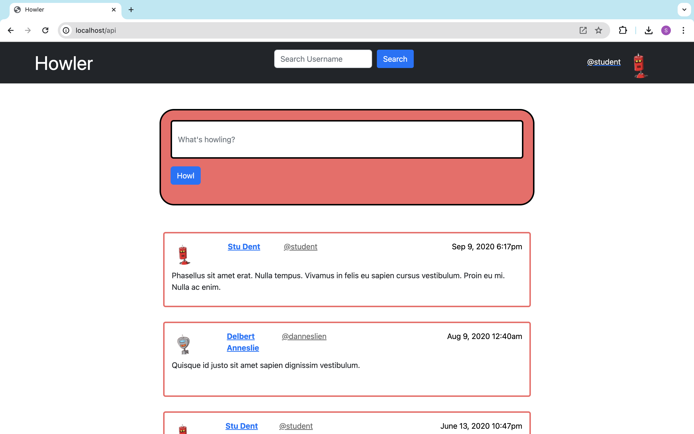

# Homework 4: Howler

To run:
1. Clone this repo
2. Run npm install
3. Run npm start (starts server)
4. Open localhost:80 in any browser

This Node.js app is a basic client-side rendered social network page called Howler. If Twitter is for birds, Howler is for wolves. User sessions are implemented so multiple users/browsers can be logged in simultaneously and updates can be seen by all users. For example, try opening this application in google chrome and safari after running the server. You can start a howler conversation between both sessions!

I designed and implemented a REST API for Howler based on provided mock/initial data, and a frontend that consumes this API to provide functionality.

---

## How Does Howler Work?

Howler allows users to post a "howl": a text entry of what's on their mind. Users can also read what other users they follow have "howled" in reverse chronological order (newest at the top). To support this functionality, Howler's views include the following:

### Login Page

Howler requires the user to log in before posting or viewing content. You can use these accounts to test with.

Username: student
Password: password

Username: graduate
Password: password

### Main Page

This is the main view of Howler and allows users to post a new howl and view howls of users they follow (not all users). Here's a wireframe:



### User Profile Page

Users can view other users' profiles, which will contain their name, username, a list of users they follow, and will display the howls posted by that user in reverse chronological order. If the logged-in user follows the owner of a profile, this page will display an indication of that and the ability to unfollow. Otherwise, there is an option to follow the user so that their howls will be displayed in the logged-in user's main page. Click on a user's name or avatar to go to their profile page. The user profile page looks like this:


## Description of the Data

Mock/initial data is provided in the [src/data folder](src/data) in 3 files: `users.json`, `howls.json`, and `follows.json`. The first file, `users.json`, contains an array of all users in the system. Here's an example of a user record:

```json
{
  "id": 1,
  "first_name": "Stu",
  "last_name": "Dent",
  "username": "student",
  "avatar": "https://robohash.org/veniamdoloresenim.png?size=64x64&set=set1"
}
```

The `id` and `username` are unique for each user. The `avatar` entry is the URL of an image the user has chosen for their profile.

The second file, `howls.json`, contains previous howls from users in the system. A howl entry looks like this:

```json
{
  "id": 1,
  "userId": 7,
  "datetime": "2022-05-29T03:50:25Z",
  "text": "Donec odio justo, sollicitudin ut, suscipit a, feugiat et, eros. Vestibulum ac est lacinia nisi venenatis tristique. Fusce congue, diam id ornare imperdiet, sapien urna pretium nisl, ut volutpat sapien arcu sed augue. Aliquam erat volutpat."
}
```

Each howl has a unique `id` and the user who posted it is identified by `userId`, which corresponds to the `id` attribute of the user entry. There is a `datetime` entry indicating the timestamp when the howl was posted and `text` contains the howl itself.

Finally, `follows.json` contains the initial data for users following other users. It's a big object keyed on the IDs of users. For example, consider this smaller "`follows`" object:

```json
{
  "1": {
    "userId": 1,
    "following": [
      24,
      6,
      7
    ]
  },
  "2": {
    "userId": 2,
    "following": [
      4,
      12
    ]
  }
}
```

This says that user with ID 1 follows users with IDs 24, 6, and 7, while user with ID 2 follows users with IDs 4 and 12. 

## REST API

I created an Express server project and organized code in modules. The API is mounted under the `/api` base route to avoid colliding with the view (frontend) routes or static resources (i.e., all API URLs will start with `/api`).

When it runs, the API will load the provided JSON files to populate its initial state. The API will store all its data in memory (new howls, follows and unfollows after initial load), so it will revert to the initial/mock data once the server is restarted.

#### API Endpoints

Method | Route                 | Description
------ | --------------------- | ---------
`GET` | `/authenticateduser`           | Gets the current user object
`POST ` | `/howl`              | Creates a new howl
`GET ` | `/howls/:userId`              | Gets list of howls posted by userId
`GET ` | `/feed`              | Gets howls posted by users the current user follows
`GET` | `/users/id/:userId`        | Gets a user object by userId
`GET`  | `/users/username/:username`  | Gets a user object by username
`GET`  | `/following/:userId`  | Gets the list of users that a specific user follows
`POST`  | `/follow/:userId`  | Follow a user by its id
`PUT`  | `/unfollow/:userId`         | Unfollow a user by its id

---

## Frontend

I created Howler's web interface using [Bootstrap](https://getbootstrap.com/). This interface is responsive, which means it accommodates being rendered on a desktop browser as well as on a mobile browser. Bootstrap can help with this when used properly.

The same server for the REST API also serves the frontend. The server does not serve HTML files statically. Instead, routes are used (e.g., http://localhost/about instead of http://localhost/about.html). Howler is client-side rendered, so data is be populated on the pages from the REST API instead of directly embedded in the HTML sent by the server.

---

## Reflection

1. An interesting challenge you encountered when implementing Howler. What was the issue, and how did you solve it?

I had finished the functionality of all the pages but was testing with multiple browsers open and realized the browsers would switch to the same current user. I solved this issue by implementing user sessions so that the current user would be unique to the session. The data would be saved as long as the server was running and both sessions could access the same data even though they would be logged in as different users.

2. What additional feature would you add to Howler, and how would you suggest it should be implemented?

I would add a like and comment functionality to make it more similar to a social media app. This would be similar to implementing the following list and howl list. I would make a global variable to store the list of likes and comments and map them to their howl ids and the user that liked/commented. I would create initial json data for that like the howls.json and follows.json files.
